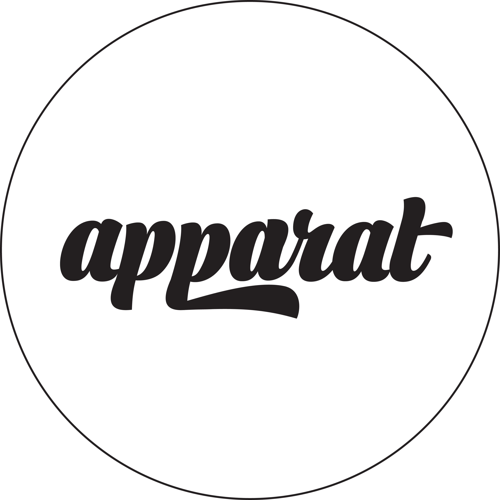

# Octobiwan

<br/>

[](https://travis-ci.org/eaardal/apparat-generator)


## How to use

In Slack:

```
/apparat
```

## Development

* Install everything: `npm i`
* Run locally: `npm start`
* Run tests (once): `npm test` or `npm run jest`
* Run tests (watch): `npm run test:watch` or `npm run jest:watch` or `npm run jest:watchall`

## Deployment

* All branches are built by Travis CI
  ([https://travis-ci.org/eaardal/apparat-generator](https://travis-ci.org/eaardal/apparat-generator))
* Code pushed to `master` is deployed to Heroku
  ([https://apparat-generator.herokuapp.com](https://apparat-generator.herokuapp.com))

### Services used

* [Heroku account](https://signup.heroku.com/)
* [Heroku CLI](https://devcenter.heroku.com/articles/heroku-cli)

* [Travis CI account](https://travis-ci.org/)
* [Travis CLI](https://github.com/travis-ci/travis.rb#installation)
